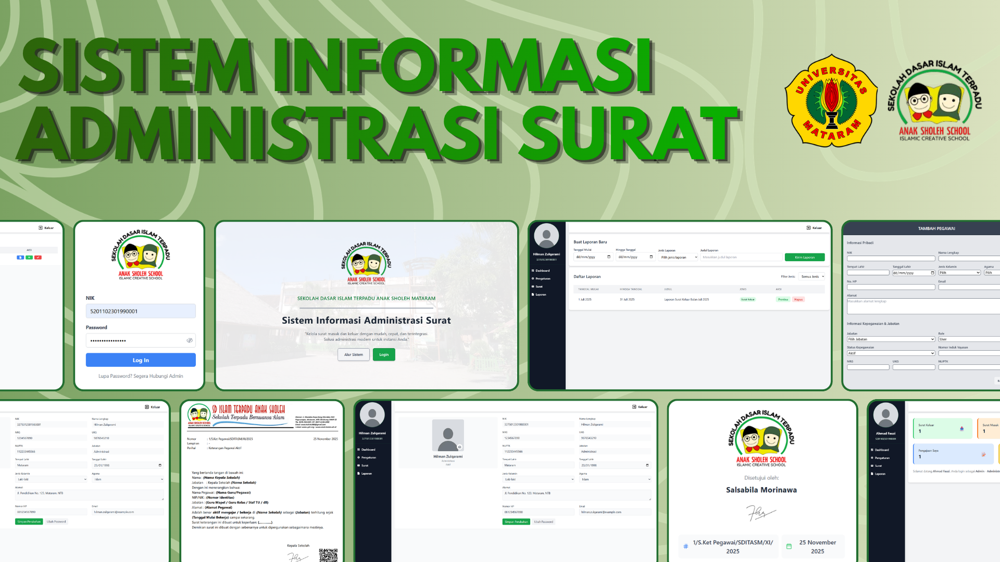

# Letter Administration Information System – SDIT Anak Sholeh Mataram

## 📌 Project Overview

This repository is a final project developed to fulfill the requirements for a Bachelor's degree in Informatics. The project is a **Letter Administration Information System** built for **SDIT Anak Sholeh Mataram**. This system was designed to streamline and digitalize letter-related administrative processes in a school environment. It provides features that support the creation, archiving, and reporting of official letters.

## ✅ Key Features

1. **Outgoing Letter Creation**
   - Letter preview before submission
   - Automatic letter numbering
   - QR code generation for letter validation

2. **Incoming Letter Recording**
   - Archiving of incoming letters
   - Disposition feature for internal processing

3. **Letter Reports**
   - Generate reports for incoming and outgoing letters
   - Filter by specific time periods

## 🛠️ Tech Stack

- **Frontend**: React.js
- **Backend**: Express.js
- **Database**: MySQL (via Sequelize ORM)
- **Other Tools**: QR Code Generator, JWT Auth

## 📚 Purpose

This project serves as a real-world implementation of an information system tailored for educational institutions, aiming to improve efficiency, accuracy, and traceability in school correspondence.
